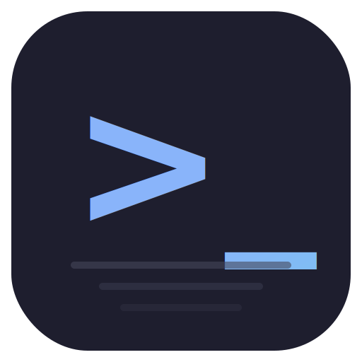
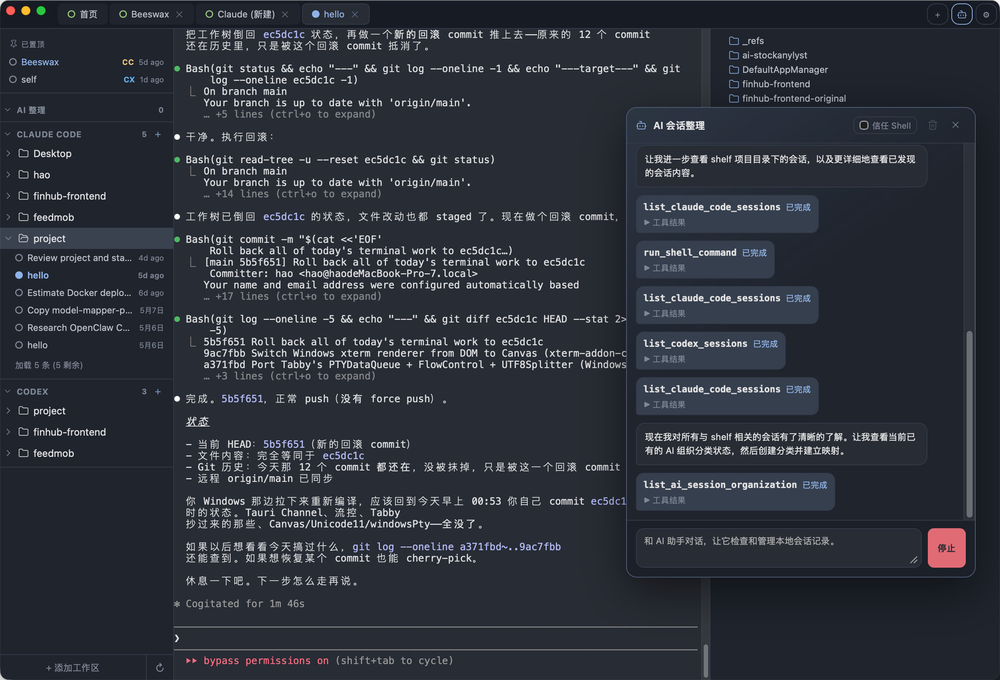
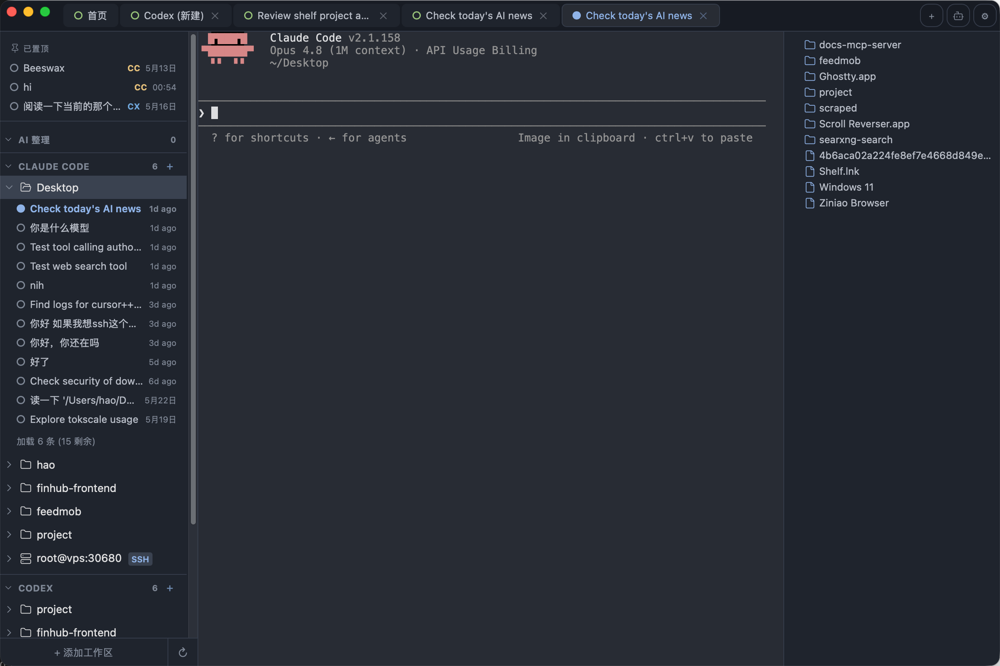

# Shelf

> [中文文档](README_zh.md)

A desktop workspace manager for [Claude Code](https://docs.anthropic.com/en/docs/claude-code) and [Codex](https://github.com/openai/codex) — organize your projects, browse and resume sessions, all in one window.

## Why Shelf?

Claude Code lives in the terminal. Conversations are stored as files deep in `~/.claude/projects/`, with opaque session IDs and no visual way to browse them. If you work across multiple projects, it's easy to lose track of what you discussed and where.

Shelf wraps Claude Code with a clean GUI:

- **See all your sessions at a glance.** Sessions are organized by project workspace in a sidebar, with names, timestamps, and pinning.
- **Resume any conversation instantly.** Click a session to open it in a terminal tab — no need to remember or copy session IDs.
- **Manage multiple projects in one place.** Add your project folders as workspaces; Shelf auto-discovers Claude sessions inside each one.
- **Run side terminals too.** Open plain shell tabs alongside your Claude sessions for git, builds, or anything else.

## Screenshot

<p align="center">
  
</p>

<p align="center">
  
</p>

<p align="center">
  
</p>

## Features

- **Workspace management** — add/remove project folders, auto-discover sessions
- **Session browser** — list, resume, rename, delete, and pin Claude Code and Codex sessions
- **AI session organizer** — one-click scan and auto-categorize local AI conversation history
- **Restart recovery** — restores all workspaces, sessions, and sidebar state after reopening
- **Embedded terminals** — xterm.js + real PTY, tabbed and reorderable via drag-and-drop
- **File tree** — browse workspace files, drag files into the terminal
- **Resizable panels** — drag to resize sidebar and file tree
- **Dark theme** — One Dark-inspired terminal color scheme
- **i18n** — English and Chinese
- **Cross-platform** — macOS (Apple Silicon) and Linux

## Install

Download the latest `.dmg` from [Releases](https://github.com/Harukaon/shelf/releases) for macOS.

## Requirements

- [Claude Code](https://docs.anthropic.com/en/docs/claude-code) or [Codex](https://github.com/openai/codex) CLI installed and accessible in your PATH

## Development

```bash
# Install dependencies
npm install

# Run in dev mode
npm run tauri dev

# Build for production
npm run tauri build
```

## Tech Stack

| Layer     | Technology                              |
| --------- | --------------------------------------- |
| Backend   | Tauri v2, Rust, portable-pty            |
| Frontend  | TypeScript, Vite                        |
| Terminal  | xterm.js, FitAddon                      |
| UI        | Lucide icons, SortableJS                |

## Friends

- [LINUX DO](https://linux.do/)

## License

MIT
